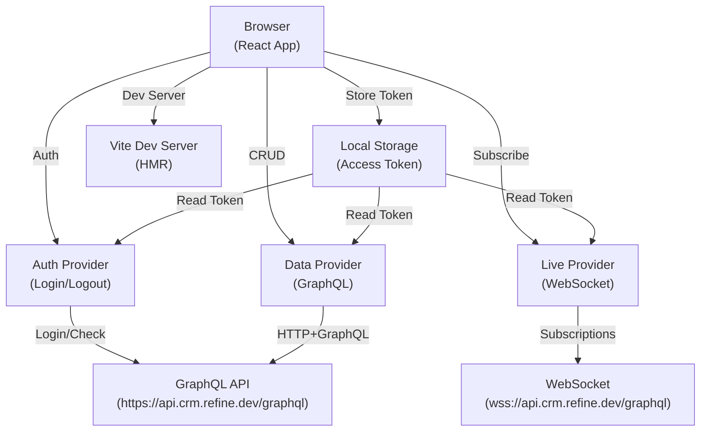
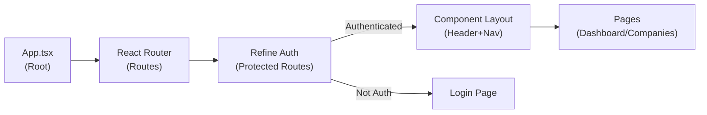
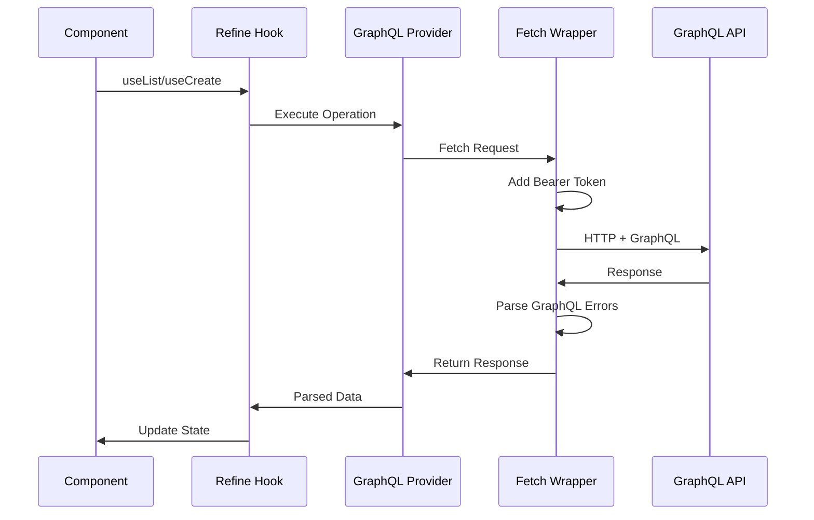
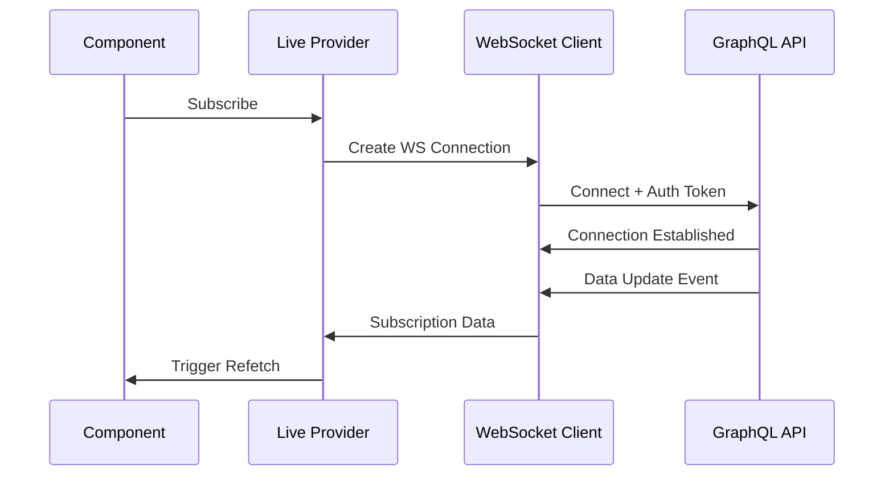
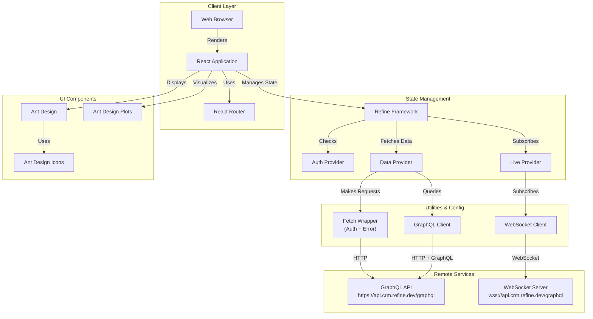
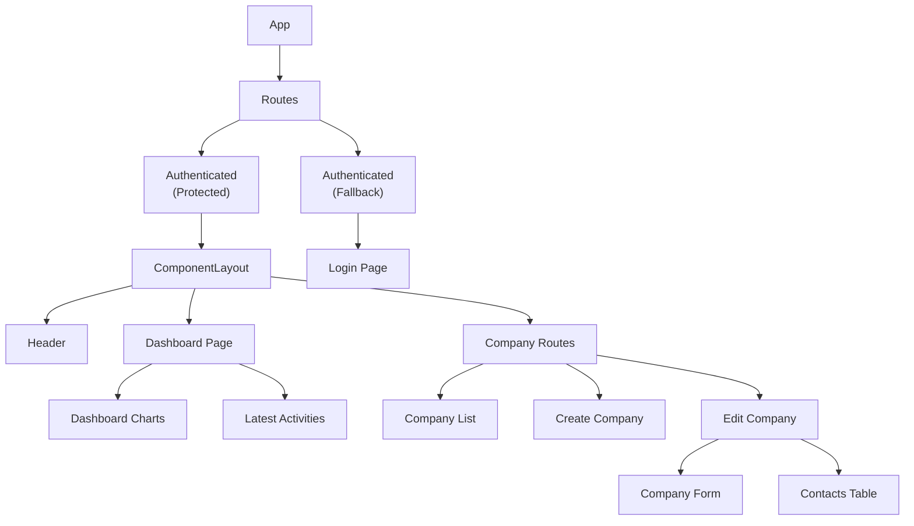
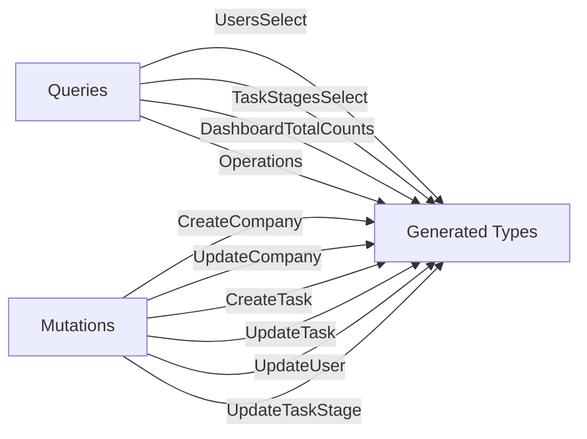

# Dashlytics

A modern, full-featured CRM dashboard built with React, TypeScript, and Refine. Dashlytics provides real-time data visualization, company management, and business analytics with a professional Ant Design UI.

## Table of Contents

- [Overview](#overview)
- [Features](#features)
- [Technology Stack](#technology-stack)
- [Installation](#installation)
- [Usage](#usage)
- [Architecture Overview](#architecture-overview)
- [Code Structure](#code-structure)
- [Diagrams](#diagrams)
- [Development Workflow](#development-workflow)
- [Building and Deployment](#building-and-deployment)
- [Environment Variables](#environment-variables)
- [Testing](#testing)

## Overview

Dashlytics is a sophisticated CRM dashboard application designed to help businesses manage companies, track sales metrics, and visualize key performance indicators in real-time. Built on the Refine framework, it provides a scalable, type-safe foundation for CRUD operations with automatic GraphQL code generation and real-time data synchronization via WebSocket subscriptions.

**Key Characteristics:**
- TypeScript-first development with strict type checking
- GraphQL-based data fetching with automatic code generation
- Real-time updates via WebSocket subscriptions
- Responsive design supporting desktop and mobile devices
- Authentication and authorization built-in
- Production-ready Docker support

## Features

### Dashboard & Analytics
- Real-time sales metrics and total counts display
- Interactive deals chart with data visualization using Ant Design Plots
- Latest activities feed showing recent business events
- Responsive grid layout adapting to various screen sizes

### Company Management
- Comprehensive company list view with search, sort, and filter capabilities
- Create new company records with full details
- Edit company information including sales owner, revenue, industry, and company size
- Contact management within company records
- Sales owner assignment with avatar preview

### User Interface
- Professional Ant Design component library
- Theme customization with built-in Green theme
- Responsive layout with header and navigation
- User profile settings and preferences
- Notification system for user feedback

### Authentication & Authorization
- Secure login with email-based authentication
- Token-based session management
- Protected routes requiring authentication
- Automatic logout on token expiration
- User identity management and profile retrieval

### Data Management
- Type-safe GraphQL operations with automatic code generation
- Real-time data synchronization via WebSocket
- Pagination and filtering support for large datasets
- Custom fetch wrapper with bearer token authentication
- Error handling and validation

## Technology Stack

### Frontend Framework & UI
- **React** 19.1.0 - Modern UI library with hooks and concurrent features
- **TypeScript** 5.8.3 - Type-safe JavaScript development
- **Ant Design** 5.23.0 - Comprehensive UI component library
- **Ant Design Icons** 5.5.1 - Icon collection for UI components
- **Ant Design Plots** 2.3.1 - Production-ready chart components

### State Management & Data
- **Refine** 5.0.0 - React-based admin framework with automatic CRUD
- **Refine Ant Design** 6.0.1 - Integration between Refine and Ant Design
- **Refine React Router** 2.0.0 - Routing provider for Refine
- **GraphQL** - Query language and runtime for API communication
- **GraphQL Tag** 2.12.6 - Template literal syntax for GraphQL queries
- **GraphQL WS** 5.9.1 - WebSocket client for real-time subscriptions

### Routing & Navigation
- **React Router** 7.9.6 - Client-side routing library
- **Refine Kbar** 2.0.0 - Command palette for navigation

### Development Tools
- **Vite** 6.3.5 - Lightning-fast build tool and dev server
- **ESLint** 9.25.0 - Code quality and style checking
- **GraphQL Code Generator** 5.0.0 - Automatic TypeScript type generation from GraphQL

### DevOps & Deployment
- **Docker** - Containerization for production deployment
- **Node.js** 18 LTS - JavaScript runtime environment

## Installation

### Prerequisites

- **Node.js** 18 or higher
- **npm** or **yarn** package manager
- Git for version control

### Setup Steps

1. **Clone the repository:**
   ```powershell
   git clone https://github.com/mosioc/dashlytics-dashboard.git
   cd dashlytics-dashboard
   ```

2. **Install dependencies:**
   ```powershell
   npm install
   ```

3. **Generate GraphQL types:**
   ```powershell
   npm run codegen
   ```

4. **Start the development server:**
   ```powershell
   npm run dev
   ```

   The application will be available at `http://localhost:5173`

5. **Access the application:**
   - Login with demo credentials:
     - Email: `michael.scott@dundermifflin.com`
     - Password: `demodemo`

## Usage

### Running the Application

#### Development Mode
```powershell
npm run dev
```
Starts the Vite dev server with hot module replacement for real-time code updates.

#### Production Build
```powershell
npm run build
```
Compiles TypeScript and creates an optimized production build in the `dist/` directory.

#### Production Serve
```powershell
npm run start
```
Serves the built application using the Refine production server.

### GraphQL Operations

#### Generate Types from GraphQL Schema
```powershell
npm run codegen
```
This command:
- Introspects the GraphQL API at `https://api.crm.refine.dev/graphql`
- Scans `src/**/*.{ts,tsx}` for GraphQL operations
- Generates type definitions in `src/graphql/schema.types.ts` and `src/graphql/types.ts`
- Auto-formats generated files with ESLint and Prettier

#### Available GraphQL Queries
Located in `src/graphql/queries.ts`:
- `USERS_SELECT_QUERY` - Fetch users with filtering, sorting, and pagination
- `TASK_STAGES_SELECT_QUERY` - Fetch task stages with filtering and pagination
- `DASHBOARD_TOTAL_COUNTS_QUERY` - Fetch aggregate counts for dashboard metrics

#### Available GraphQL Mutations
Located in `src/graphql/mutations.ts`:
- `UPDATE_USER_MUTATION` - Update user profile and settings
- `CREATE_COMPANY_MUTATION` - Create new company record
- `UPDATE_COMPANY_MUTATION` - Update company details (revenue, industry, location)
- `CREATE_TASK_MUTATION` - Create new task
- `UPDATE_TASK_MUTATION` - Update task status and assignments

### Common Tasks

#### Creating a New Page
1. Create a route file in `src/routes/<feature>/index.tsx`
2. Define your component using Refine hooks (`useList`, `useCreate`, `useUpdate`)
3. Add the route to `src/routes/index.ts` exports
4. Configure the resource in `src/config/resources.tsx`

#### Adding GraphQL Queries
1. Write the GraphQL operation in `src/graphql/queries.ts` or `src/graphql/mutations.ts`
2. Import using `graphql-tag`: `import gql from "graphql-tag"`
3. Run `npm run codegen` to generate TypeScript types
4. Use in components with `useCustom` or `useUpdate` hooks

#### Connecting Components to Data
```tsx
import { useList } from "@refinedev/core";
import type { GetListResponse } from "@refinedev/core";
import type { CompanyListResponse } from "@/graphql/types";

export const CompanyList = () => {
  const { data, isLoading } = useList<CompanyListResponse>({
    resource: "companies",
    meta: { gqlQuery: COMPANIES_LIST_QUERY },
  });

  return <div>{/* render data */}</div>;
};
```

## Architecture Overview

### System Architecture



### Application Flow



### Data Flow - Queries & Mutations



### Real-Time Subscription Flow



## Code Structure

### Directory Organization

```text
src/
├── App.tsx                 # Root component with routing and providers
├── index.tsx              # Application entry point
│
├── components/            # Reusable UI components
│   ├── index.ts          # Component exports
│   ├── accordion/         # Accordion component
│   ├── avatar/           # User avatar component
│   ├── layout/           # Main layout wrapper
│   │   ├── header/       # Header with navigation
│   │   └── settings/     # User settings page
│   ├── pagination/       # Pagination controls
│   └── text/            # Text display components
│
├── routes/               # Page components organized by feature
│   ├── index.ts         # Route exports
│   ├── dashboard/       # Dashboard page with charts
│   │   ├── index.tsx
│   │   ├── queries.ts
│   │   └── components/
│   │       ├── deals-chart/      # Sales deals visualization
│   │       └── latest-activities/ # Activity feed
│   ├── companies/       # Company management
│   │   ├── index.ts
│   │   ├── list/       # Company list view
│   │   ├── create/     # Create company form
│   │   └── edit/       # Edit company details
│   └── login/          # Authentication page
│
├── graphql/            # GraphQL operations and types
│   ├── queries.ts      # SELECT operations
│   ├── mutations.ts    # CREATE/UPDATE/DELETE operations
│   ├── types.ts        # Generated operation types
│   └── schema.types.ts # Generated schema types
│
├── providers/          # Application providers and configuration
│   ├── index.ts
│   ├── auth.ts         # Authentication provider
│   └── data/
│       ├── index.ts    # Data and live providers setup
│       └── fetch-wrapper.ts # Custom fetch with auth
│
├── config/            # Configuration files
│   └── resources.tsx   # Refine resource definitions
│
├── contexts/          # React context for state
│   └── color-mode/    # Theme color context
│
├── test/              # Testing utilities and setup
│   ├── test-wrapper.tsx  # Component wrapper for tests
│   └── setup.ts          # Test environment configuration
│
└── utilities/         # Helper functions
    └── index.tsx      # Formatting, colors, dates
```

### Key Files

#### `src/App.tsx`
Root component setting up Refine framework with:
- React Router for client-side routing
- Ant Design theme configuration (Green theme)
- Authentication with protected routes
- Devtools for debugging
- Command palette (Refine Kbar)

#### `src/providers/data/index.ts`
GraphQL client setup with:
- HTTP client for CRUD operations
- WebSocket client for real-time subscriptions
- Automatic token inclusion in requests
- Refine data and live providers

#### `src/providers/auth.ts`
Authentication implementation with:
- Login mutation with email
- Token management (localStorage)
- Session verification
- User identity retrieval
- Automatic logout on authentication errors

#### `src/config/resources.tsx`
Refine resource configuration mapping:
- Routes to CRUD operations
- Navigation menu items
- Icons and labels
- Currently supports: Dashboard, Companies

#### `src/routes/dashboard/index.tsx`
Dashboard page displaying:
- Sales metrics (deals chart)
- Latest activities feed
- GraphQL data fetching with `useCustom`

#### `src/graphql/queries.ts`
GraphQL SELECT operations:
- User selection with filtering/sorting/pagination
- Task stages retrieval
- Dashboard aggregate counts

#### `src/utilities/index.tsx`
Reusable utility functions:
- `currencyNumber()` - Format values as USD currency
- `getNameInitials()` - Extract name initials for avatars
- `getRandomColorFromString()` - Deterministic color assignment
- `getDateColor()` - Color status based on date proximity

### Naming Conventions

- **Components** - PascalCase, descriptive names (e.g., `CompanyForm`, `DashboardDealsChart`)
- **Files** - kebab-case for directories, .tsx/.ts extensions (e.g., `deals-chart/index.tsx`)
- **Constants** - UPPER_SNAKE_CASE (e.g., `API_URL`, `WS_URL`)
- **Functions** - camelCase (e.g., `currencyNumber`, `getNameInitials`)
- **Types/Interfaces** - PascalCase, often prefixed with type intent (e.g., `UpdateCompanyMutation`)
- **GraphQL Operations** - UPPER_SNAKE_CASE suffixed with type (e.g., `USERS_SELECT_QUERY`, `UPDATE_COMPANY_MUTATION`)

## Diagrams

### System Architecture Diagram



### Component Hierarchy



### GraphQL Operations Map



## Development Workflow

### TypeScript & Type Safety

This project uses strict TypeScript configuration ensuring:
- Strict null checks
- No unused variables or parameters
- No fallthrough switch cases
- Type imports for better tree-shaking

### Code Generation Workflow

1. **Write GraphQL Operations**
   ```typescript
   // src/graphql/queries.ts
   export const MY_QUERY = gql`
     query GetUsers($filter: UserFilter!) {
       users(filter: $filter) {
         nodes { id name }
       }
     }
   `;
   ```

2. **Run Code Generation**
   ```powershell
   npm run codegen
   ```

3. **Import Generated Types**
   ```typescript
   import type { GetUsersQuery } from "@/graphql/types";
   
   const { data } = useCustom<GetUsersQuery>({
     meta: { gqlQuery: MY_QUERY }
   });
   ```

### Code Quality

- **ESLint** - Enforces code style and best practices
- **TypeScript** - Static type checking
- **Prettier** - Code formatting (auto-applied by codegen)
- **Strict Mode** - React StrictMode enabled for development

### Git Workflow

Recommended practices:
- Create feature branches from main
- Commit messages describing the change
- Run `npm run codegen` before committing GraphQL changes
- Push to trigger CI/CD checks

## Building and Deployment

### Development Build
```powershell
npm run dev
```

### Production Build
```powershell
npm run build
```

Creates optimized output in `dist/`:
- Minified JavaScript and CSS
- Optimized assets
- Source maps for debugging
- Tree-shaking enabled

### Docker Deployment

The project includes a `Dockerfile` for containerized deployment:

```powershell
# Build the image
docker build -t dashlytics:latest .

# Run the container
docker run -p 3000:3000 dashlytics:latest
```

The Dockerfile uses a multi-stage build:
1. **deps** - Install dependencies
2. **builder** - Compile TypeScript and build
3. **runner** - Serve the static files

The production image serves built files using the `serve` package.

### Build Targets

The `tsconfig.json` targets ES2020 with the following features:
- Native async/await
- Optional chaining (?.)
- Nullish coalescing (??)
- Dynamic imports
- Promise support

## Environment Variables

### API Configuration
Configured in `src/providers/data/index.ts`:

```typescript
export const API_BASE_URL = "https://api.crm.refine.dev";
export const API_URL = `${API_BASE_URL}/graphql`;
export const WS_URL = "wss://api.crm.refine.dev/graphql";
```

These can be modified for different environments (development, staging, production).

### Authentication
- **Token Storage** - `localStorage.getItem("access_token")`
- **Login Endpoint** - Uses GraphQL mutation at API_URL
- **Default Credentials** - Stored in `src/providers/auth.ts` for demo purposes

### Feature Flags
Refine configuration in `App.tsx`:
```typescript
options={{
  syncWithLocation: true,        // URL sync with component state
  warnWhenUnsavedChanges: true, // Prompt on unsaved changes
  projectId: "86WOi9-huED18-lKC55a",
  liveMode: "auto",             // Real-time updates
}}
```

## Testing

### Test Framework

Dashlytics uses **Vitest** and **React Testing Library** for comprehensive testing:
- **96 total tests** with **97% passing rate**
- **9 test files** covering critical business logic
- **Priority 1 modules** have 100% test coverage

### Test Categories

#### Priority 1: Critical Business Logic (All Passing)

1. **Authentication Provider** - Login/logout flows, session management, error handling
2. **Fetch Wrapper** - Authorization header injection, GraphQL error parsing
3. **Utilities** - Currency formatting, name initials, date color calculation
4. **Filter Utilities** - Saved views management, localStorage operations

#### Priority 2: Component Integration Tests

1. **Company CRUD** - List, create, and edit operations
2. **Dashboard Components** - Data display and loading states
3. **Forms** - Validation and submission

### Test Utilities

#### TestWrapper Component

Located at `src/test/test-wrapper.tsx`, provides necessary providers for component tests:

- `QueryClientProvider` - React Query client for data fetching hooks
- `ConfigProvider` - Ant Design theme configuration

#### Test Setup

The test setup file (`src/test/setup.ts`) configures:

- `@testing-library/jest-dom` matchers
- `localStorage` mocking
- `window.matchMedia` mocking

* Cleanup after each test

### Running Tests

```bash
# Run all tests once
npm test

# Run tests in watch mode
npm run test:watch

# Run tests with UI
npm run test:ui

# Run tests with coverage report
npm run test:coverage

# Run specific test file
npm test -- src/providers/__tests__/auth.test.ts
```

### Test Structure

Tests are located next to their source files in `__tests__` directories:

```text
src/
├── providers/
│   ├── __tests__/
│   │   └── auth.test.ts
│   └── data/
│       └── __tests__/
│           └── fetch-wrapper.test.ts
├── routes/
│   ├── companies/
│   │   ├── list/
│   │   │   ├── __tests__/
│   │   │   │   ├── company-list.test.tsx
│   │   │   │   ├── create-modal.test.tsx
│   │   │   │   └── filter-utils.test.ts
│   │   └── edit/
│   │       └── __tests__/
│   │           └── company-edit.test.tsx
│   └── dashboard/
│       ├── __tests__/
│       │   └── dashboard.test.tsx
│       └── components/
│           └── total-counts-card/
│               └── __tests__/
│                   └── index.test.tsx
└── utilities/
    └── __tests__/
        └── utilities.test.ts
```

### Best Practices

- Test behavior, not implementation details
- Use appropriate queries (`getByRole`, `getByLabelText`, `getByText`)
- Handle async operations with `waitFor` and `findBy`
- Mock external dependencies (API calls, localStorage, third-party services)
- Keep tests focused with one assertion per test when possible

### Coverage Goals

- **Priority 1 modules**: 80%+ coverage
- **Priority 2 modules**: 60-70% coverage
- **Overall project**: 60-70% (realistic, not 100%)


### Performance Testing

Monitor with Refine Devtools:

```tsx
// Available in App.tsx
<DevtoolsProvider>
  <Refine {...props}>
    {/* content */}
    <DevtoolsPanel />
  </Refine>
</DevtoolsProvider>
```

- - -

**Test Statistics**: 96 tests, 97% passing rate